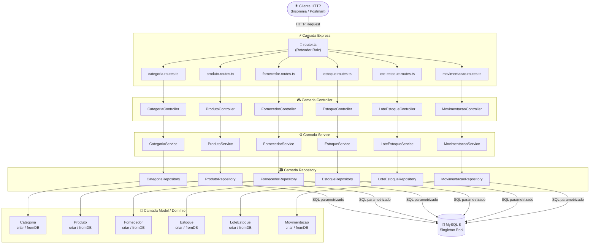
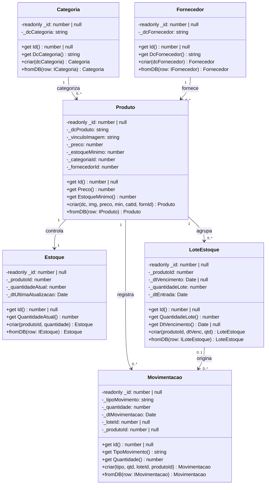
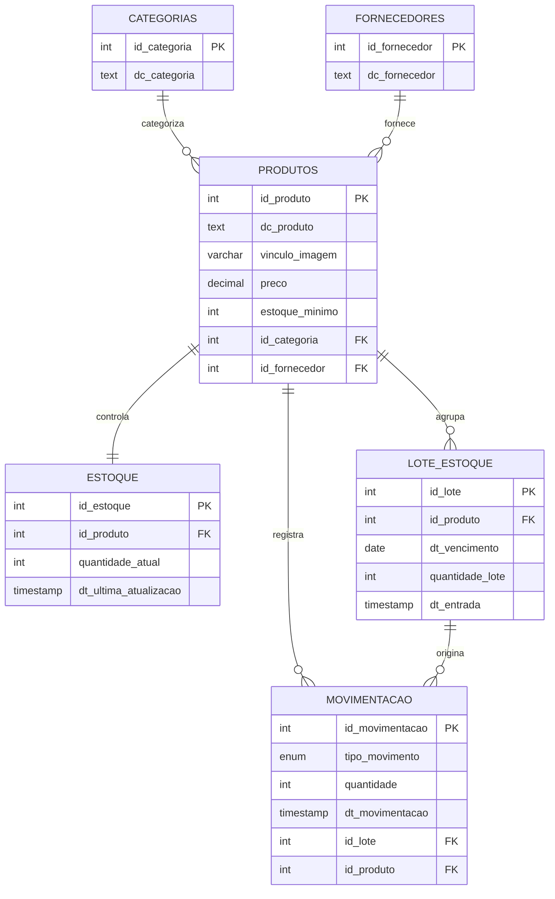
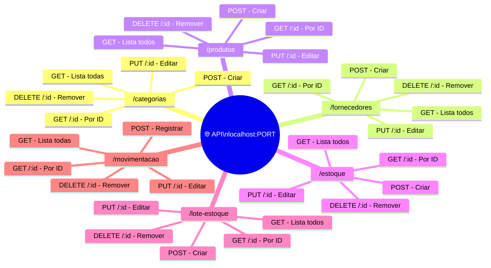
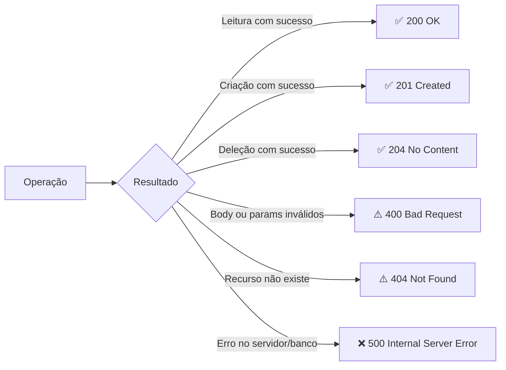
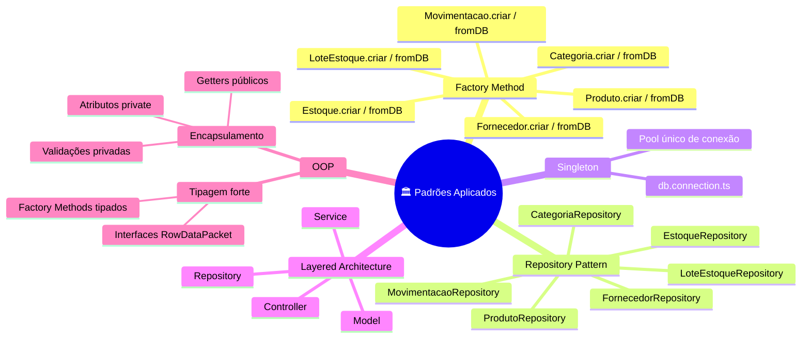
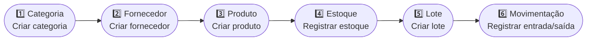

# 📦 StockPlus API

<div align="center">


[](https://sonarcloud.io/summary/new_code?id=rafafrd_StockPlus-Distribuidora)

</div>

> API RESTful para gerenciamento de **Estoque** desenvolvida com **TypeScript**, **Express** e **MySQL2**. O projeto aplica **Orientação a Objetos** com encapsulamento e padrões de projeto **Factory Method**, **Repository** e **Singleton**, organizados em uma arquitetura limpa em camadas.

---

## 📋 Sumário

- [Visão Geral](#-visão-geral)
- [Estrutura do Projeto](#-estrutura-do-projeto)
- [Arquitetura](#️-arquitetura)
- [Modelo de Domínio](#-modelo-de-domínio-oop)
- [Banco de Dados](#️-banco-de-dados)
- [Endpoints da API](#-endpoints-da-api)
- [Padrões de Projeto](#-padrões-de-projeto)
- [Tecnologias](#️-tecnologias)
- [Como Executar](#-como-executar)

---

## 🔎 Visão Geral

A **StockPlus API** é um sistema backend completo para gestão de estoque, cobrindo o ciclo de: cadastro de **Categorias**, **Fornecedores**, **Produtos** (com vínculo de imagem), controle de **Estoque**, **Lotes** e **Movimentações** de entrada e saída.

O projeto foi construído com foco em:

- **Separação de responsabilidades** rigorosa entre as camadas
- **Entidades ricas** com validações encapsuladas nas próprias classes de domínio
- **Factory Methods estáticos** (`criar`, `fromDB`) em todos os models
- **Código limpo** sem helpers genéricos desnecessários

---

## 📁 Estrutura do Projeto

```
├── 📁 docs
│   ├── 📄 db.sql
│   ├── ⚙️ insomnia-stockplus.json
│   └── 📝 mermaid.md
├── 📁 src
│   ├── 📁 config
│   │   ├── 📁 enum
│   │   │   └── 📄 EnvKey.ts
│   │   └── 📄 EnvVar.ts
│   ├── 📁 controllers
│   │   ├── 📄 categoria.controller.ts
│   │   ├── 📄 estoque.controller.ts
│   │   ├── 📄 fornecedor.controller.ts
│   │   ├── 📄 lote-estoque.controller.ts
│   │   ├── 📄 movimentacao.controller.ts
│   │   └── 📄 produto.controller.ts
│   ├── 📁 database
│   │   └── 📄 db.connection.ts
│   ├── 📁 models
│   │   ├── 📄 categoria.model.ts
│   │   ├── 📄 estoque.model.ts
│   │   ├── 📄 fornecedor.model.ts
│   │   ├── 📄 lote-estoque.model.ts
│   │   ├── 📄 movimentacao.model.ts
│   │   └── 📄 produto.model.ts
│   ├── 📁 repository
│   │   ├── 📄 categoria.repository.ts
│   │   ├── 📄 estoque.repository.ts
│   │   ├── 📄 fornecedor.repository.ts
│   │   ├── 📄 lote-estoque.repository.ts
│   │   ├── 📄 movimentacao.repository.ts
│   │   └── 📄 produto.repository.ts
│   ├── 📁 routes
│   │   ├── 📄 categoria.routes.ts
│   │   ├── 📄 estoque.routes.ts
│   │   ├── 📄 fornecedor.routes.ts
│   │   ├── 📄 lote-estoque.routes.ts
│   │   ├── 📄 movimentacao.routes.ts
│   │   ├── 📄 produto.routes.ts
│   │   └── 📄 router.ts
│   ├── 📁 services
│   │   ├── 📄 categoria.service.ts
│   │   ├── 📄 estoque.service.ts
│   │   ├── 📄 fornecedor.service.ts
│   │   ├── 📄 lote-estoque.service.ts
│   │   ├── 📄 movimentacao.service.ts
│   │   └── 📄 produto.service.ts
│   └── 📄 server.ts
├── ⚙️ .gitignore
├── 📝 README.md
├── 📝 claude.md
├── ⚙️ package.json
└── ⚙️ tsconfig.json
```

---

## 🏗️ Arquitetura

O projeto adota uma **arquitetura em 4 camadas** com fluxo de dependência unidirecional. O `router.ts` raiz agrega todos os sub-roteadores, e cada camada possui responsabilidade única e bem definida.



### Responsabilidades por Camada

| Camada         | Arquivo(s)        | Responsabilidade                                                    |
| -------------- | ----------------- | ------------------------------------------------------------------- |
| **Route**      | `*.routes.ts`     | Mapear verbos HTTP para métodos do Controller                       |
| **Controller** | `*.controller.ts` | Receber requisições HTTP, validar entrada, retornar respostas       |
| **Service**    | `*.service.ts`    | Orquestrar regras de negócio, instanciar objetos via Factory Method |
| **Repository** | `*.repository.ts` | Executar queries SQL com parâmetros seguros                         |
| **Model**      | `*.model.ts`      | Representar entidades com encapsulamento e factory methods          |

---

## 🧬 Modelo de Domínio (OOP)

Todos os models seguem o padrão de entidade orientada a objeto com atributos privados, getters públicos e factory methods estáticos.



---

## 🗄️ Banco de Dados (Database)

O banco utiliza **MySQL 8** com chaves estrangeiras, restrições de integridade e registro automático de datas via `DEFAULT CURRENT_TIMESTAMP`.

### Diagrama Entidade-Relacionamento



### Relacionamentos

| Relacionamento             | Cardinalidade | Descrição                                       |
| -------------------------- | ------------- | ----------------------------------------------- |
| Categoria → Produto        | 1:N           | Uma categoria agrupa vários produtos            |
| Fornecedor → Produto       | 1:N           | Um fornecedor fornece vários produtos           |
| Produto → Estoque          | 1:1           | Cada produto possui um registro de estoque      |
| Produto → LoteEstoque      | 1:N           | Um produto pode ter vários lotes                |
| Produto → Movimentacao     | 1:N           | Um produto pode ter várias movimentações        |
| LoteEstoque → Movimentacao | 0..1:N        | Uma movimentação pode estar associada a um lote |

---

## 📡 Endpoints da API

### 🏷️ Categorias — `/categorias`

| Método   | Rota              | Descrição                 |
| -------- | ----------------- | ------------------------- |
| `GET`    | `/categorias`     | Lista todas as categorias |
| `GET`    | `/categorias/:id` | Busca categoria por ID    |
| `POST`   | `/categorias`     | Cria uma nova categoria   |
| `PUT`    | `/categorias/:id` | Atualiza uma categoria    |
| `DELETE` | `/categorias/:id` | Remove uma categoria      |

### 🏭 Fornecedores — `/fornecedores`

| Método   | Rota                | Descrição                   |
| -------- | ------------------- | --------------------------- |
| `GET`    | `/fornecedores`     | Lista todos os fornecedores |
| `GET`    | `/fornecedores/:id` | Busca fornecedor por ID     |
| `POST`   | `/fornecedores`     | Cria um novo fornecedor     |
| `PUT`    | `/fornecedores/:id` | Atualiza um fornecedor      |
| `DELETE` | `/fornecedores/:id` | Remove um fornecedor        |

### 📦 Produtos — `/produtos`

| Método   | Rota            | Descrição               |
| -------- | --------------- | ----------------------- |
| `GET`    | `/produtos`     | Lista todos os produtos |
| `GET`    | `/produtos/:id` | Busca produto por ID    |
| `POST`   | `/produtos`     | Cria um novo produto    |
| `PUT`    | `/produtos/:id` | Atualiza um produto     |
| `DELETE` | `/produtos/:id` | Remove um produto       |

### 🗃️ Estoque — `/estoque`

| Método   | Rota           | Descrição                           |
| -------- | -------------- | ----------------------------------- |
| `GET`    | `/estoque`     | Lista todos os registros de estoque |
| `GET`    | `/estoque/:id` | Busca estoque por ID                |
| `POST`   | `/estoque`     | Cria um registro de estoque         |
| `PUT`    | `/estoque/:id` | Atualiza um registro de estoque     |
| `DELETE` | `/estoque/:id` | Remove um registro de estoque       |

### 📋 Lotes — `/lote-estoque`

| Método   | Rota                | Descrição            |
| -------- | ------------------- | -------------------- |
| `GET`    | `/lote-estoque`     | Lista todos os lotes |
| `GET`    | `/lote-estoque/:id` | Busca lote por ID    |
| `POST`   | `/lote-estoque`     | Cria um novo lote    |
| `PUT`    | `/lote-estoque/:id` | Atualiza um lote     |
| `DELETE` | `/lote-estoque/:id` | Remove um lote       |

### 🔄 Movimentações — `/movimentacao`

| Método   | Rota                | Descrição                    |
| -------- | ------------------- | ---------------------------- |
| `GET`    | `/movimentacao`     | Lista todas as movimentações |
| `GET`    | `/movimentacao/:id` | Busca movimentação por ID    |
| `POST`   | `/movimentacao`     | Registra uma movimentação    |
| `PUT`    | `/movimentacao/:id` | Atualiza uma movimentação    |
| `DELETE` | `/movimentacao/:id` | Remove uma movimentação      |

### Mapa de Rotas



### Códigos HTTP



---

## 📐 Padrões de Projeto



| Padrão                   | Onde é Aplicado                                         | Benefício                                                                      |
| ------------------------ | ------------------------------------------------------- | ------------------------------------------------------------------------------ |
| **Factory Method**       | Métodos estáticos `criar` e `fromDB` em todos os models | Controla criação de objetos, centraliza validações, evita instâncias inválidas |
| **Repository Pattern**   | `*Repository` — um por entidade                         | Isola o SQL, torna o Service agnóstico ao banco, facilita manutenção           |
| **Singleton**            | `db.connection.ts` — pool de conexão único              | Evita múltiplas conexões abertas, otimiza uso de recursos                      |
| **Layered Architecture** | Toda a estrutura do projeto                             | Separação clara de responsabilidades e manutenibilidade                        |

---

## 🛠️ Tecnologias

### Dependências de Produção

| Pacote    | Versão | Uso                              |
| --------- | ------ | -------------------------------- |
| `express` | 5.x    | Framework HTTP                   |
| `mysql2`  | 3.x    | Driver MySQL com suporte a Pool  |
| `dotenv`  | latest | Leitura de variáveis de ambiente |

### Dependências de Desenvolvimento

| Pacote           | Versão | Uso                            |
| ---------------- | ------ | ------------------------------ |
| `typescript`     | 5.x    | Linguagem                      |
| `ts-node`        | 10.x   | Execução de TypeScript         |
| `nodemon`        | 3.x    | Live reload em desenvolvimento |
| `@types/express` | latest | Tipagens Express               |
| `@types/node`    | latest | Tipagens Node.js               |

---

## 🚀 Como Executar

### Pré-requisitos

- Node.js (LTS)
- MySQL 8+
- npm

### Variáveis de Ambiente

Crie um arquivo `.env` na raiz do projeto:

```env
DB_HOST=localhost
DB_PORT=3306
DB_USER=root
DB_PASSWORD=sua_senha
DB_NAME=StockPlus_db
PORT=3000
```

### Instalação

```bash
# Instalar dependências
npm install

# Criar o banco de dados
# Execute o arquivo docs/db.sql no seu MySQL

# Iniciar em desenvolvimento
npm run dev

# Compilar para produção
npm run build

# Iniciar em produção
npm start
```

### Testes com Insomnia

Importe o arquivo `docs/insomnia-stockplus.json` no Insomnia via **File → Import → From File** e siga a ordem recomendada:



> ⚠️ Siga essa ordem para evitar erros de chave estrangeira (FK).

---

<div align="center">
  <sub>Projeto Acadêmico Backend SENAI — TypeScript · Express · MySQL2 · OOP · Design Patterns</sub>
</div>
